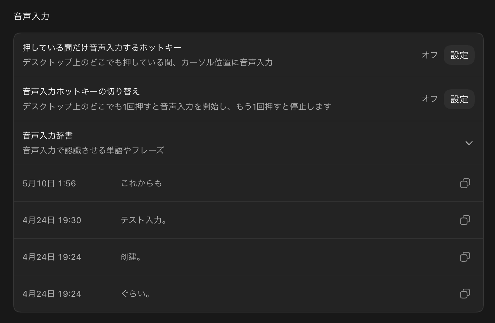
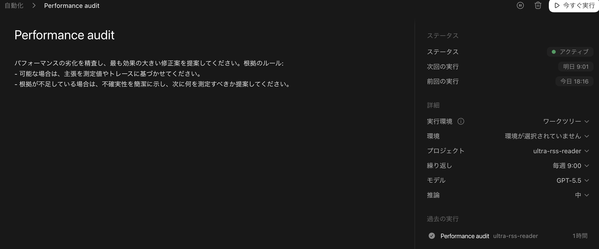

# Codex App Hands-on

今日は、Codex Appを「チャット画面」ではなく、開発ワークスペースとして使います。

このリポジトリは、Next.js、shadcn/ui、Base UIのセットアップまで済ませたスターターです。

---

# 今日やること

空の説明ではなく、実際に1つの画面を作ります。

- 方針を `DESIGN.md` に置く
- Codex Appにプロジェクトを読ませる
- 小さな管理画面を作る
- in-app browserで確認する
- Gitの差分を見る
- VOICEVOXとAutomationsも軽く触る

---

# 先にチェックアウト

```bash
git clone https://github.com/jey3dayo/codex-app-hands-on.git
cd codex-app-hands-on
npm install
npm run dev
```

開発サーバが起動したら、Codex Appのin-app browserで開きます。

```text
http://localhost:3000
```

---

# スターターで止めてある理由

完全に空だと、セットアップの時間が読めません。

今日は、環境構築よりもCodex Appでの進め方を見たいので、足場だけ先に置いてあります。

完成画面はまだ入っていません。ここからCodex Appに作ってもらいます。

---

# 見てほしい流れ

Codex Appは、単に返事を書く場所ではありません。

ターミナル、ファイル編集、ブラウザ確認、Git差分、MCP、Automationsが同じスレッドに集まります。

この「同じ場所で進む」感じを見てください。

---

# 最初に貼るプロンプト

```text
AGENT_HANDOFF.md、DESIGN.md、HANDS_ON.mdを読んで、このリポジトリの目的を確認して。

今日は30分のCodex Appハンズオン用に、小さな管理画面を作りたい。
まだ完成画面は作らず、まず既存構成と使えるコマンドを確認して、短く作業方針を出して。
```

---

# UIを作るプロンプト

```text
DESIGN.mdの方針に沿って、1画面で完結する小さな管理画面を作って。

題材はハンズオン運営のタスク管理でいいです。
shadcn/uiとBase UIのセットアップ済み状態を活かして、見た目の変化がブラウザで分かるところまで実装して。
完了後に型チェック、リント、ビルドのうち、このリポジトリで使える確認を実行して。
```

---

# ブラウザ確認のプロンプト

```text
開発サーバを起動して、in-app browserで画面を確認して。

レイアウト崩れ、文字の重なり、ボタンの押しやすさを見て、気になるところがあれば直して。
```

---

# 差分レビューのプロンプト

```text
今の差分をコードレビューして。

バグ、見た目の崩れ、型安全性、テスト不足の順に見て、問題があれば修正して。
問題がなければ、変更内容と実行した確認コマンドを短くまとめて。
```

---

# Goalで仕上げる

最後は、曖昧な「いい感じ」ではなく、止め時を決めます。

`prepare-goal`でゴールを固めてから、レビューと修正を回します。

```text
prepare-goal
humanizer-ja

/goal ハンズオン用の小さな管理画面が、当日のデモに出せる状態になっている。
Done means DESIGN.mdの方針に沿った1画面のUIが実装され、in-app browserで表示確認でき、レビュー自己採点が95点以上になるまで修正済み。
Scope: app、components、lib、DESIGN.mdに直接関係する変更だけ。
Constraints: 完成度を上げるための余計な機能追加はしない。any型、型アサーション、不要なドキュメント追加、秘密情報の変更は禁止。日本語の説明はhumanizer-jaの観点でAIっぽさを落とす。
Verification: npm run build、npm run lint、npm run typecheckを実行し、in-app browserで見た結果、レビュー点数、変更ファイル、残ったリスクを報告する。
Stop if 同じ原因で3回失敗した、要件が曖昧で判断できない、破壊的操作が必要になった、または95点以上に到達した。
```

---

# 音声入力を見せる

Codex Appに話しかける入口も、画面で見せた方が早いです。

「喋らせる」と「声で操作する」は別物として扱います。



---

# VOICEVOXを見せる

深掘りはしません。

「作業が進んでいることを、スレッド外にも出せる」例として見せます。

使う設定はこれです。

```text
speaker=1
speedScale=1.3
async=true
```

---

# Automationsを見せる

ここも短く。

たとえば、こう頼めることだけ見せます。

```text
明日の朝、このスレッドをもう一度開いて、残っているTODOを確認して。
```

今日の主役はAutomationsではなく、開発作業が同じスレッドに残ることです。



---

# Computer Useは最後

Computer Useは、アプリ操作まで任せたいときに使います。

ただし今日は、まずCodex Appだけで開発の流れが通ることを見せます。

そのあとで「画面の外にも触れる」という位置づけで紹介します。

---

# まとめ

今日のポイントは1つです。

Codex Appは、会話だけの道具ではありません。

プロジェクトの文脈を読み、ファイルを直し、ターミナルを動かし、ブラウザで確認し、差分まで見られる開発場所です。

ここまで同じスレッドで残るのが、かなり効きます。
